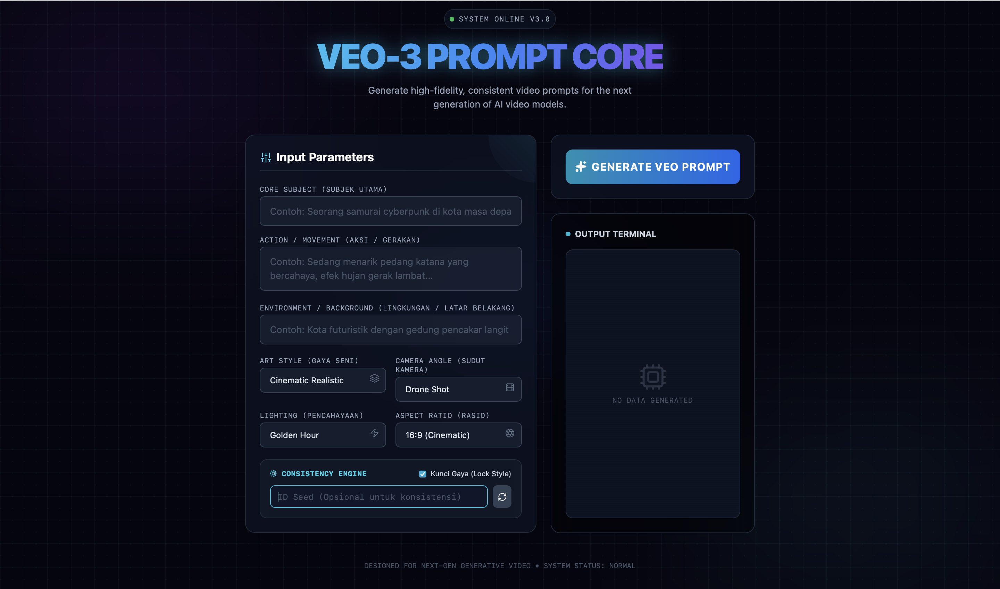

# VEO-NEXUS

A sophisticated web application for generating optimized prompts for VEO-3, the next-generation AI video generation model. Built with React, Vite, and Tailwind CSS v4.

## 🚀 Features

- **Advanced Prompt Generation**: Create high-fidelity video prompts optimized for VEO-3
- **Interactive UI**: Modern, cyberpunk-inspired interface with smooth animations
- **Comprehensive Controls**: Subject, action, environment, style, camera, lighting, and technical parameters
- **Consistency Engine**: Seed-based generation for consistent results
- **Real-time Preview**: Live terminal-style output display
- **Copy to Clipboard**: Easy prompt copying for use in AI tools
- **Responsive Design**: Works seamlessly on desktop and mobile devices

## 📸 Screenshots

### Main Interface

*The main prompt generation interface with cyberpunk styling*

## 🛠️ Tech Stack

- **Frontend**: React 19.2.0
- **Build Tool**: Vite with Rolldown
- **Styling**: Tailwind CSS v4
- **Icons**: Lucide React
- **Development**: ESLint, PostCSS, Autoprefixer

## 📋 Prerequisites

- Node.js (v18 or higher)
- npm or yarn

## 🚀 Installation & Setup

### Clone the Repository

```bash
git clone https://github.com/RafaXzaviero/VEO-NEXUS.git
cd VEO-NEXUS
```

### Install Dependencies

```bash
npm install
```

### Start Development Server

```bash
npm run dev
```

The application will be available at `http://localhost:5173/`

### Build for Production

```bash
npm run build
```

### Preview Production Build

```bash
npm run preview
```

### Lint Code

```bash
npm run lint
```

## 💡 Usage

1. **Fill in the Parameters**:
   - **Subject**: Main object or character
   - **Action**: Movement or activity
   - **Environment**: Background setting
   - **Style**: Visual art style
   - **Camera**: Shot type and angle
   - **Lighting**: Lighting conditions
   - **Aspect Ratio**: Video dimensions
   - **Duration**: Video length

2. **Configure Consistency**:
   - Enable "Lock Style" for consistent generation
   - Set a custom seed or use random generation

3. **Generate Prompt**:
   - Click "GENERATE VEO PROMPT"
   - Wait for AI processing simulation
   - Copy the optimized prompt for use in VEO-3

## 🎨 Customization

The application uses Tailwind CSS v4 with custom animations and cyberpunk-inspired theming. Key styling files:

- `src/index.css`: Global styles and Tailwind imports
- `tailwind.config.js`: Tailwind configuration
- `src/VeoPromptGen.jsx`: Main component with inline styles

## 🤝 Contributing

1. Fork the repository
2. Create a feature branch (`git checkout -b feature/amazing-feature`)
3. Commit your changes (`git commit -m 'Add amazing feature'`)
4. Push to the branch (`git push origin feature/amazing-feature`)
5. Open a Pull Request

## 📄 License

This project is licensed under the MIT License - see the [LICENSE](LICENSE) file for details.

## 🙏 Acknowledgments

- VEO-3 by Google for inspiring this prompt generator
- Tailwind CSS for the amazing utility-first framework
- Lucide for beautiful icons
- Vite for lightning-fast development

---

**Designed for Next-Gen Generative Video • System Status: NORMAL**
